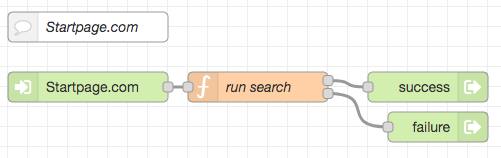

# node-red-flow-startpage #

Node-RED flow to run an internet search using Startpage.com and parse its findings

## Installation ##

## Usage ##

### Example ###

File [Startpage-Example.json](./Startpage-Example.json) contains a simple example: just import its contents into your Node-RED flow editor and configure the injection node with the desired search text and language.

Shortly after pressing the injection button, the debug output should show up to 10 properly parsed search results.

## License ##

[MIT License](LICENSE.md)
